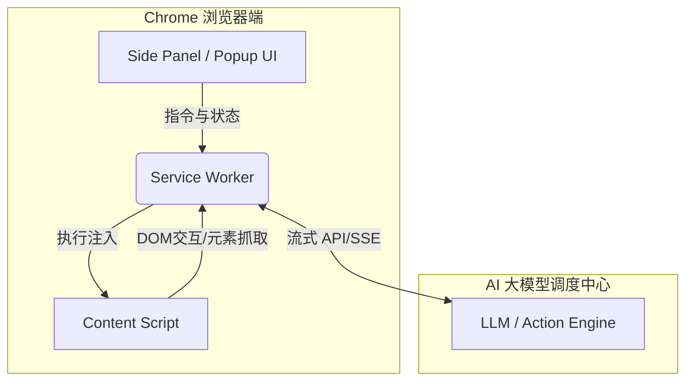

# Manus 风格 AI 浏览器操作员插件：设计与实操落地路径

## 1. 核心定位与业务价值
此插件的核心在于**利用用户已有的本地浏览器登录态和会话**，让 AI 能够像真人一样绕过验证码和会话过期限制，执行跨域名的复杂任务。

### 落地应用场景：
*   **竞品与市场监控：** 自动穿梭于 Crunchbase 和 PitchBook 提取并比对数据。
*   **SEO 与数据富化：** 在 Semrush、Ahrefs 中批量审计，自动补充 CRM 客户背景信息。
*   **高频重复流转：** 在财务、运营内部系统的跨页面报表提取与表单填报。

---

## 2. 总体系统架构设计 (Architecture)
整体采用 **Chrome Extension + 外部 Agent 核心** 的前后端分离架构。



*   **Service Worker (后台调度):** 作为消息总线，维持任务队列，通过 Fetch API 流式调用大模型，分发 Action。
*   **Content Script (页面注入):** 挂载于每个 Tab，负责实际的 DOM 操作（`click`, `input`, `scroll` 等），并将页面转换为 AI 可理解的结构树。
*   **Side Panel (用户交互):** 提供类似 Cursor 侧边栏的对话体验，实时打印任务进度和 Tool Calls 状态。

---

## 3. 核心技术模块与实操方案

### 3.1 扩展权限声明 (Manifest V3)
必须申请以下核心权限：
*   `activeTab`, `tabs`: 页面管理与状态监控。
*   `scripting`: 动态注入执行脚本。
*   `storage`: 存储 API Key 及本地配置。
*   `host_permissions`: `<all_urls>` 以支持全网域操作。

### 3.2 页面状态解析 (Observation)
**难点：** LLM 无法直接理解海量杂乱的 HTML。
**落地解法：**
1.  **无障碍树提取 (Accessibility Tree):** 过滤掉装饰性标签，仅提取具有 `role` 和 `name` 的可交互元素（如按钮、输入框、链接）。
2.  **元素打标 (Element Indexing):** 为每个可交互 DOM 节点注入一个高亮的数字 ID（例如 `[12]`）。大模型只需要输出 `Click(12)`，Content Script 即可精准定位并触发 `element.click()`。

### 3.3 动作执行引擎 (Action)
支持以下原子操作集：
*   `navigate(url)`: 页面跳转。
*   `click(element_id)`: 触发点击前，先调用 `scrollIntoView()` 确保元素在视口内。
*   `type(element_id, text)`: 模拟原生按键事件触发，避免 React/Vue/Angular 拦截不到变更。
*   `extract(selector)`: 结构化数据提取。

---

## 4. AI Agent 工作流闭环 (Plan-Act-Observe)
核心采用参考 `browser-use` 框架的思考行动循环机制：

1.  **感知 (Observe):** Content Script 抓取当前页面精简结构，回传 Service Worker。
2.  **决策 (Plan):** 结合 Prompt（任务目标 + 历史记录 + 当前页面树），调用 LLM。
3.  **执行 (Act):** 解析 LLM 响应中的 Function Calls，下发到目标 Tab 执行操作。
4.  **校验 (Evaluate):** 检查页面是否发生预期变化，决定是进入下一步还是报错重试。

---

## 5. 项目分期实施路径 (Roadmap)

### 第一阶段 (MVP): 核心链路打通
*   搭建基础 Manifest V3 脚手架。
*   实现 Content Script 针对特定网站的 DOM 简化和元素 ID 注入。
*   在 Service Worker 中跑通 OpenAI/Anthropic API 的基础 Tool Calling 循环。

### 第二阶段: Agent 框架集成
*   引入并适配核心逻辑（若使用 `browser-use` 等 Python 框架，可通过本地 WebSocket Server 桥接，或者使用纯 JS 重写核心控制循环）。
*   完善 Side Panel UI，支持自然语言输入与执行日志滚动显示。

### 第三阶段: 体验与稳定性优化
*   **容错机制：** 页面加载超时、元素未找到时的 AI 自动重试与换词搜索策略。
*   **人工接管：** 随时可以点击停止任务，或者由用户代为完成图形验证码后，恢复执行态。

### 第四阶段: 安全审计与合规上线
*   **强制授权：** 重要流转或开启新跨域会话时，要求用户界面点击二次确认。
*   **本地存储：** API Key 与任何敏感信息仅通过 `chrome.storage.local` 留存在本地设备，确保不上传云端。


# AI 浏览器操作员插件 (对标 Manus)：核心架构与实现细节补充文档

在基础架构打通后，要实现类似 Manus 般稳定、流畅且拟人化的浏览器接管体验，必须在 DOM 降噪解析、Agent 动作契约、异常状态机以及多标签页协同调度上进行深度设计。以下为针对实操落地的补充设计细节。

---

## 1. 深度状态解析系统 (Advanced Observation)

传统的 HTML 源码直接输入大模型会导致严重的 Token 浪费和幻觉。必须在 Content Script 中建立一套高效的“网页降噪与结构化”机制。

### 1.1 DOM 剪裁与视觉可见性计算
大模型只需要知道“人类肉眼可见且可交互”的元素。
*   **过滤隐藏节点：** 遍历 DOM 树，严格过滤 `display: none`、`visibility: hidden`、`opacity: 0` 以及宽高为 0 的元素。
*   **视口碰撞检测：** 结合 `getBoundingClientRect()` 计算元素是否在当前视口 (Viewport) 内。对于在视口外的重要元素，标记为 `requires_scroll`。
*   **交互属性提取：** 仅提取带有点击事件 (`<a>`, `<button>`, `[role="button"]`) 和输入事件 (`<input>`, `<textarea>`) 的节点。

### 1.2 动态标识注入 (Interactive Indexing)
为每个筛选出的交互元素生成一个全局唯一的 ID（如 `[id=15]`），并在页面上通过绝对定位的 `div` 将该 ID 浮空显示在元素旁边。
*   **实操案例：** 当模型解析到一个包含 "Sign In" 文字的按钮时，只需输出 `{"action": "click", "target_id": 15}`，Content Script 收到后直接执行 `document.querySelector('[data-agent-id="15"]').click()`。

---

## 2. Agent 动作契约与调度设计 (Action & Tool Calling)

在 Service Worker 与大模型的通信中，需定义严格的 JSON Schema 契约，确保大模型输出的每一步操作具备确定性和可执行性。

### 2.1 核心 Tool Calling 规范
```json
{
  "name": "browser_operator",
  "description": "执行浏览器页面操作",
  "parameters": {
    "type": "object",
    "properties": {
      "thought": {
        "type": "string",
        "description": "执行该操作的逻辑思考过程"
      },
      "action": {
        "type": "string",
        "enum": ["click", "type", "scroll", "navigate", "extract_data", "wait"],
        "description": "需要执行的具体动作"
      },
      "target_id": {
        "type": "integer",
        "description": "交互元素的唯一ID（click和type动作必需）"
      },
      "value": {
        "type": "string",
        "description": "需要输入的文本内容或跳转的URL"
      }
    },
    "required": ["thought", "action"]
  }
}
```

### 2.2 动态渲染 (SPA) 异步等待策略

现代前端框架 (React/Vue) 渲染存在延迟。

- **MutationObserver 监控：** 每次操作后，Content Script 启动 `MutationObserver` 监听 DOM 树变化。
- **静默期判定：** 若 500ms 内 DOM 无新变化且网络请求无 Pending 状态，则认为页面加载完成，触发下一次“感知 (Observe)”并回传截图/DOM树给大模型。

## 3. 异常处理与状态流转机 (Error Recovery)

无人值守执行时，必须具备强大的自恢复与中断能力。

### 3.1 常见异常分支设计

1. **目标元素消失 (Element Not Found)：** 若大模型请求点击 `ID: 20`，但该元素在重绘后失效。
   - *处理机制：* Service Worker 拦截错误，强制 Content Script 重新扫描生成新的 DOM 树和 ID，连同错误信息 `{"error": "Element 20 missing, DOM refreshed"}` 发回大模型，要求其重新规划动作。
2. **触发反爬与验证码 (CAPTCHA Detected)：**
   - *处理机制：* Content Script 检测到 `iframe` 内含 reCAPTCHA 等特征时，立即暂停 Agent 执行流。向 Side Panel 发送警报声和视觉高亮，等待人工介入。人工完成验证后，点击“继续执行”恢复状态机。

## 4. 商业落地场景：CRM 竞品数据自动化采集流程

以“自动从 Crunchbase 提取指定公司融资信息并回填至内部 CRM”为例，展示多环节协同：

1. **会话复用：** 插件直接复用浏览器内已登录的 Crunchbase 会话，无需在插件层配置账密。
2. **跨 Tab 调度：**
   - Service Worker 打开 `Tab A` (Crunchbase) 搜索目标公司。
   - 获取关键数据后，Service Worker 新开或切换至 `Tab B` (CRM 系统录入页)。
3. **循环执行与交叉验证：**
   - 模型生成 `["Search(Company X)", "Extract(Funding)", "SwitchTab(B)", "Type(Funding_Input)"]` 的任务流。
   - 每执行一步，通过右侧 Side Panel 实时打印 `[Thought: 找到融资金额字段，准备写入] -> [Action: Type '$50M' into Input_12]`，确保执行过程对操作者完全透明，可随时点击 `Stop` 阻断。


# Manus 风格 AI 浏览器操作员插件：最终设计方案文档

## 一、项目概述

### 1.1 核心定位

本插件对标 Manus Browser Operator，核心价值在于**利用用户本地浏览器的已有登录态和会话**，让 AI 像真人一样绕过验证码和会话过期限制，执行跨域名的复杂浏览器自动化任务。

### 1.2 核心应用场景

| 场景               | 说明                                                     |
| :----------------- | :------------------------------------------------------- |
| **竞品与市场监控** | 自动穿梭于 Crunchbase、PitchBook 提取并比对数据          |
| **SEO 与数据富化** | 在 Semrush、Ahrefs 中批量审计，自动补充 CRM 客户背景信息 |
| **高频重复流转**   | 财务、运营内部系统的跨页面报表提取与表单填报             |

## 二、总体系统架构

采用 **Chrome Extension + 外部 Agent 核心** 的前后端分离架构。


### 2.1 核心组件职责

| 组件               | 职责                                                         |
| :----------------- | :----------------------------------------------------------- |
| **Service Worker** | 消息总线，任务队列管理，流式调用大模型，分发 Action          |
| **Content Script** | DOM 操作（click、input、scroll），页面结构树转换             |
| **Side Panel**     | 类 Cursor 侧边栏对话体验，实时任务进度与 Tool Calls 状态显示 |

## 三、技术实现方案

### 3.1 Manifest V3 权限声明

json

```
{
  "manifest_version": 3,
  "permissions": ["activeTab", "tabs", "scripting", "storage"],
  "host_permissions": ["<all_urls>"],
  "background": { "service_worker": "background.js" },
  "side_panel": { "default_path": "sidepanel.html" }
}
```


**权限说明**：`activeTab`/`tabs` 用于页面管理与状态监控，`scripting` 用于动态注入执行脚本，`storage` 用于存储 API Key 及本地配置，`<all_urls>` 支持全网域操作。

### 3.2 页面状态解析（Observation）

#### 3.2.1 DOM 降噪与可见性计算

- **过滤隐藏节点**：剔除 `display:none`、`visibility:hidden`、`opacity:0` 及宽高为0的元素
- **视口碰撞检测**：通过 `getBoundingClientRect()` 判断元素是否在当前视口内
- **交互属性提取**：仅提取带有点击事件（`<a>`、`<button>`、`[role="button"]`）和输入事件（`<input>`、`<textarea>`）的节点

#### 3.2.2 元素索引注入

为每个可交互 DOM 节点注入高亮数字 ID（如 `[12]`），通过绝对定位 `div` 浮空显示。大模型只需输出 `Click(12)`，Content Script 即可精准定位并执行 `element.click()`。

### 3.3 Agent 动作契约（Tool Calling Schema）

json

```
{
  "name": "browser_operator",
  "description": "执行浏览器页面操作",
  "parameters": {
    "type": "object",
    "properties": {
      "thought": { "type": "string", "description": "执行该操作的逻辑思考过程" },
      "action": {
        "type": "string",
        "enum": ["click", "type", "scroll", "navigate", "extract_data", "wait"],
        "description": "需要执行的具体动作"
      },
      "target_id": { "type": "integer", "description": "交互元素的唯一ID" },
      "value": { "type": "string", "description": "输入文本或跳转URL" }
    },
    "required": ["thought", "action"]
  }
}
```


### 3.4 核心原子操作集

| 操作                     | 实现要点                                            |
| :----------------------- | :-------------------------------------------------- |
| `navigate(url)`          | 页面跳转                                            |
| `click(element_id)`      | 先 `scrollIntoView()` 确保元素在视口内，再触发点击  |
| `type(element_id, text)` | 模拟原生按键事件，确保 React/Vue/Angular 能捕获变更 |
| `extract(selector)`      | 结构化数据提取                                      |

### 3.5 SPA 异步等待策略

- **MutationObserver 监控**：每次操作后监听 DOM 树变化
- **静默期判定**：500ms 内 DOM 无新变化且网络请求无 Pending 状态，则判定页面加载完成

## 四、AI Agent 工作流闭环（Plan-Act-Observe）


1. **感知（Observe）**：Content Script 抓取当前页面精简结构，回传 Service Worker
2. **决策（Plan）**：结合 Prompt（任务目标 + 历史记录 + 当前页面树），调用 LLM
3. **执行（Act）**：解析 LLM 响应中的 Function Calls，下发到目标 Tab 执行
4. **校验（Evaluate）**：检查页面是否发生预期变化，决定下一步或报错重试

## 五、异常处理与状态流转

### 5.1 异常分支设计

| 异常类型             | 处理机制                                                     |
| :------------------- | :----------------------------------------------------------- |
| **目标元素消失**     | Service Worker 拦截错误，强制重新扫描 DOM 树，连同错误信息发回大模型重新规划动作 |
| **触发反爬与验证码** | Content Script 检测 reCAPTCHA 特征时暂停 Agent，向 Side Panel 发送警报，等待人工介入完成验证后恢复执行 |

### 5.2 安全与控制机制

- **会话授权**：每次任务需用户在界面点击授权
- **即时中断**：用户可随时点击停止，或关闭标签页立即终止任务
- **操作审计**：所有操作步骤完整记录，支持审计追踪
- **本地存储**：API Key 仅通过 `chrome.storage.local` 留存本地，不上传云端

## 六、项目分期实施路径

### 第一阶段（MVP）：核心链路打通

- 搭建 Manifest V3 脚手架
- 实现 Content Script 的 DOM 简化和元素 ID 注入
- Service Worker 跑通 OpenAI/Anthropic API 的 Tool Calling 循环

### 第二阶段：Agent 框架集成

- 引入并适配 browser-use 核心逻辑（Python 框架可通过本地 WebSocket Server 桥接，或使用纯 JS 重写控制循环）
- 完善 Side Panel UI，支持自然语言输入与执行日志滚动显示

### 第三阶段：体验与稳定性优化

- **容错机制**：页面加载超时、元素未找到时的 AI 自动重试与换词搜索
- **人工接管**：随时可停止任务，或由用户完成验证码后恢复执行

### 第四阶段：安全审计与合规上线

- **强制授权**：重要流转或跨域会话时要求用户二次确认
- **本地存储**：所有敏感信息仅存于 `chrome.storage.local`

## 七、开源参考项目

| 项目                 | 特点                                                   |
| :------------------- | :----------------------------------------------------- |
| **browser-use**      | Manus 核心依赖的开源框架，Python 实现                  |
| **pie-ai-agent**     | 完整的 Chrome AI Agent 实现，含 ReAct 循环、多会话管理 |
| **chrome-ai-agent**  | 完整的 AI 网页自动化扩展，含脚本管理                   |
| **open-browser-use** | 平台中立的浏览器自动化，CLI + SDK 多语言支持           |

## 八、技术选型建议

| 维度            | 建议                                                   |
| :-------------- | :----------------------------------------------------- |
| **开发语言**    | TypeScript + React（Side Panel UI）                    |
| **构建工具**    | Vite + @crxjs/vite-plugin                              |
| **AI 模型接入** | OpenAI、Anthropic、Gemini 云端 API，或 Ollama 本地模型 |
| **Agent 框架**  | 参考 browser-use 的 ReAct 循环设计                     |
| **跨 Tab 调度** | 通过 Service Worker 管理多 Tab 切换与数据流转          |

## 一、核心功能说明

### 1.1 功能全景

| 功能模块          | 具体能力                                       | 用户价值                          |
| :---------------- | :--------------------------------------------- | :-------------------------------- |
| **会话复用引擎**  | 直接读取浏览器已登录态，无需重复输入账密       | 绕过 CAPTCHA 与会话过期限制       |
| **跨域自动化**    | 在多个网站间无缝切换，执行点击、填表、数据提取 | 完成复杂跨平台工作流              |
| **智能 DOM 理解** | 将页面交互元素结构化索引，AI 精准定位          | 避免传统 XPath/CSS 选择器的脆弱性 |
| **实时执行监控**  | Side Panel 可视化展示 Agent 思考-行动过程      | 任务透明可审计，随时可中断        |
| **远程任务触发**  | 支持从手机/其他设备发起，主电脑在线执行        | 异步自动化调度                    |

### 1.2 核心差异优势

相比传统 RPA 工具（如 UiPath、Playwright），本插件的核心突破在于：

- **无需维护选择器**：AI 动态理解页面语义，页面改版后自动适应
- **利用本地身份**：不存储密码，直接复用浏览器会话，绕过反爬
- **自然语言驱动**：用户只需描述“做什么”，AI 自主规划“怎么做”

## 二、典型应用场景详解

### 2.1 场景一：竞品融资信息采集与 CRM 回填

**用户指令**：

> “从 Crunchbase 提取最近一轮融资超过 5000 万美元的 AI 初创公司，将公司名、融资金额、投资人信息录入我们的 Salesforce CRM。”

**Agent 执行链路**：

text

```
Step 1: [Navigate] → 打开 Crunchbase 搜索页
Step 2: [Observe] → 识别搜索框，输入 “AI startup funding > 50M”
Step 3: [Act] → 点击搜索按钮，等待结果加载
Step 4: [Extract] → 从结果列表提取公司名、融资金额、投资人
Step 5: [Navigate] → 切换/新开 Tab 至 Salesforce 录入页
Step 6: [Type] → 将提取数据填入对应字段
Step 7: [Loop] → 重复 Step 1-6 直至列表处理完毕
```


### 2.2 场景二：SEO 批量审计

**用户指令**：

> “在 Semrush 中批量查询这 50 个域名的 DA、PA、反向链接数，导出为 CSV。”

**Agent 执行链路**：

- 读取本地 CSV 中的域名列表
- 逐个在 Semrush 中搜索并提取关键指标
- 遇到速率限制时自动等待重试
- 最终汇总生成结构化报表

### 2.3 场景三：内部运营系统数据迁移

**用户指令**：

> “将旧 ERP 系统的订单数据迁移到新财务系统，字段映射见附件。”

**Agent 执行链路**：

- 同时保持两个 Tab 开启（源系统 + 目标系统）
- 跨 Tab 读取→比对→填写→提交
- 每完成一条记录更新进度条

## 三、工作流程

### 3.1 用户侧工作流

text

```
┌─────────────┐    ┌─────────────┐    ┌─────────────┐    ┌─────────────┐
│  用户输入    │ →  │  授权确认   │ →  │  实时监控   │ →  │  结果交付   │
│  自然语言指令 │    │  点击授权   │    │  侧边栏直播  │    │  数据/报表   │
└─────────────┘    └─────────────┘    └─────────────┘    └─────────────┘
```


### 3.2 Agent 侧技术工作流

text

```
┌─────────────────────────────────────────────────────────────────────┐
│                       Agent 执行循环（闭环）                         │
├─────────────────────────────────────────────────────────────────────┤
│                                                                      │
│   ┌──────────┐    ┌──────────┐    ┌──────────┐    ┌──────────┐    │
│   │  OBSERVE │ →  │   PLAN   │ →  │   ACT    │ →  │ EVALUATE │    │
│   │  感知状态 │    │  决策规划 │    │  执行动作 │    │  校验结果 │    │
│   └──────────┘    └──────────┘    └──────────┘    └──────────┘    │
│        ↑                                              │             │
│        └────────────────── 循环 ──────────────────────┘             │
│                                                                      │
│   退出条件: 任务完成 / 达到最大步数 / 用户中断 / 遇到不可恢复错误    │
└─────────────────────────────────────────────────────────────────────┘
```


## 四、整体架构

### 4.1 分层架构图

text

```
┌─────────────────────────────────────────────────────────────────────┐
│                        用户交互层（UI Layer）                       │
│  ┌─────────────┐  ┌─────────────┐  ┌─────────────┐               │
│  │  Side Panel │  │  Popup      │  │  授权面板   │               │
│  │  对话+监控   │  │  快捷入口   │  │  安全确认   │               │
│  └─────────────┘  └─────────────┘  └─────────────┘               │
├─────────────────────────────────────────────────────────────────────┤
│                     调度与通信层（Orchestration）                   │
│  ┌─────────────────────────────────────────────────────────────┐  │
│  │              Service Worker（后台常驻）                     │  │
│  │  • 消息总线  • 任务队列  • 状态机  • API 流式调用          │  │
│  └─────────────────────────────────────────────────────────────┘  │
├─────────────────────────────────────────────────────────────────────┤
│                      执行与注入层（Execution）                     │
│  ┌─────────────┐  ┌─────────────┐  ┌─────────────┐              │
│  │ Content     │  │ Content     │  │ Content     │              │
│  │ Script(Tab1)│  │ Script(Tab2)│  │ Script(TabN)│              │
│  │ DOM操作/解析 │  │ DOM操作/解析 │  │ DOM操作/解析 │              │
│  └─────────────┘  └─────────────┘  └─────────────┘              │
├─────────────────────────────────────────────────────────────────────┤
│                       AI 引擎层（AI Engine）                       │
│  ┌─────────────┐  ┌─────────────┐  ┌─────────────┐              │
│  │  Planner    │  │  Executor   │  │  Reflector  │              │
│  │  任务拆解   │  │  工具调用   │  │  自我纠错   │              │
│  └─────────────┘  └─────────────┘  └─────────────┘              │
│                          │                                        │
│                     LLM API (OpenAI/Anthropic/本地)               │
└─────────────────────────────────────────────────────────────────────┘
```


### 4.2 数据流向

| 流向     | 路径                                      | 内容                            |
| :------- | :---------------------------------------- | :------------------------------ |
| **上行** | Content Script → Service Worker → LLM API | 页面结构树、执行结果、错误日志  |
| **下行** | LLM API → Service Worker → Content Script | 动作指令（click/type/navigate） |

## 五、核心模块与实现思路

### 5.1 交互模块（Side Panel UI）

| 功能区域       | 实现思路                                                     |
| :------------- | :----------------------------------------------------------- |
| **指令输入区** | 多行文本输入，支持指令模板快速填充                           |
| **执行日志区** | 滚动列表，每条日志含时间戳、Thought、Action、Result 三级展开 |
| **状态指示器** | 显示 Agent 当前状态（空闲/思考中/执行中/等待人工/已完成/错误） |
| **控制按钮**   | 开始/暂停/停止/人工接管 四个核心按钮                         |
| **会话管理**   | 历史会话列表，支持回溯和重新执行                             |

### 5.2 调度模块（Service Worker）

javascript

```
// 核心调度器伪代码
class AgentScheduler {
  constructor() {
    this.taskQueue = [];
    this.activeTabId = null;
    this.stepCounter = 0;
    this.maxSteps = 50;
    this.isRunning = false;
  }

  async runLoop(taskGoal) {
    while (this.isRunning && this.stepCounter < this.maxSteps) {
      // 1. 获取当前页面状态
      const pageState = await this.capturePageState(this.activeTabId);
      
      // 2. 构建 Prompt 并调用 LLM
      const llmResponse = await this.callLLM(taskGoal, pageState, this.history);
      
      // 3. 解析并执行动作
      const action = this.parseAction(llmResponse);
      const result = await this.executeAction(action, this.activeTabId);
      
      // 4. 记录历史并校验
      this.history.push({ action, result });
      if (result.isComplete) break;
      
      this.stepCounter++;
    }
  }
}
```


**关键设计要点**：

- 采用 **SSE（Server-Sent Events）** 流式接收 LLM 响应，实时推送 Thought 到 UI
- 维护 **全局任务状态机**：IDLE → RUNNING → PAUSED → WAITING_USER → COMPLETED → ERROR
- **心跳检测**：每 5 秒检查 Content Script 是否存活，自动重连

### 5.3 注入执行模块（Content Script）

javascript

```
// Content Script 核心操作集
const ActionExecutor = {
  // 点击：先滚动再触发
  click: (elementId) => {
    const el = document.querySelector(`[data-agent-id="${elementId}"]`);
    el.scrollIntoView({ behavior: 'smooth', block: 'center' });
    el.click();
    // 触发原生事件，确保框架响应
    el.dispatchEvent(new MouseEvent('click', { bubbles: true }));
  },

  // 输入：模拟完整键盘事件
  type: (elementId, text) => {
    const el = document.querySelector(`[data-agent-id="${elementId}"]`);
    el.focus();
    el.value = text;
    el.dispatchEvent(new Event('input', { bubbles: true }));
    el.dispatchEvent(new Event('change', { bubbles: true }));
  },

  // 提取数据：支持 CSS 选择器 + 正则
  extract: (selector, regex) => {
    const elements = document.querySelectorAll(selector);
    return Array.from(elements).map(el => el.textContent.trim());
  },

  // 页面 DOM 结构化：返回可交互元素树
  getInteractiveTree: () => {
    const elements = [];
    document.querySelectorAll('button, a, input, textarea, [role="button"], [role="link"]')
      .forEach((el, index) => {
        const rect = el.getBoundingClientRect();
        if (rect.width > 0 && rect.height > 0) {
          const id = `el_${index}`;
          el.setAttribute('data-agent-id', id);
          elements.push({
            id: id,
            tag: el.tagName,
            text: el.textContent?.trim().slice(0, 50),
            type: el.type || null,
            isVisible: rect.width > 0 && rect.height > 0,
            inViewport: rect.top >= 0 && rect.bottom <= window.innerHeight
          });
        }
      });
    return elements;
  }
};
```


### 5.4 Agent 引擎模块

**Planner（规划器）**：

- 将用户自然语言拆解为子任务序列
- 决策依据：当前页面状态 + 历史操作 + 任务目标
- 输出：下一步动作（含 Thought 解释）

**Executor（执行器）**：

- 接收动作指令，分发到对应 Tab 的 Content Script
- 支持动作队列批量下发
- 超时控制：单动作超时 30 秒自动中断

**Reflector（反思器）**：

- 对比执行前后页面变化（DOM 差异、URL 变化）
- 判断动作是否达到预期效果
- 失败时生成备选方案（如换用文本搜索定位元素）

## 六、AI Agent 核心逻辑

### 6.1 推理引擎设计

Agent 核心推理基于 **ReAct（Reasoning + Acting）** 范式，每次迭代包含：

text

```
[System Prompt]
你是一个浏览器操作专家。你的任务是通过操作浏览器来完成用户的目标。

[Context]
- 当前 URL: {url}
- 页面标题: {title}
- 当前可见交互元素: {interactive_elements_json}
- 最近 3 步操作历史: {history}

[User Goal]
{goal}

[Instructions]
1. 先思考（Thought），再决定动作
2. 如果任务已完成，输出 FINISH
3. 如果遇到障碍（如验证码），请求人工介入
4. 每次只输出一个动作

[Output Format]
{
  "thought": "我需要先找到搜索框...",
  "action": "type",
  "target_id": 5,
  "value": "OpenAI"
}
```


### 6.2 关键算法实现

**元素定位策略**（按优先级）：

1. **ID 精确匹配**：如果元素有 `data-agent-id`，直接使用
2. **语义匹配**：用文本内容模糊匹配（如按钮文字 "Sign In"）
3. **属性匹配**：用 `aria-label`、`placeholder`、`name` 属性匹配
4. **位置启发式**：根据元素在 DOM 树中的相对位置定位

**状态压缩**（Token 优化）：

- 仅保留交互元素（可点击、可输入、可选择的节点）
- 限制元素数量：最多 100 个
- 每个元素描述压缩至 50 字符以内
- 移除重复文本、无意义 ID、内联样式

## 七、Agent 工作循环（完整闭环）

### 7.1 单步循环详细流程

text

```
┌─────────────────────────────────────────────────────────────────────────┐
│                         单步执行流程                                    │
├─────────────────────────────────────────────────────────────────────────┤
│                                                                          │
│  ┌─────────────────────────────────────────────────────────────────┐   │
│  │ STEP 1: OBSERVE（感知）                                         │   │
│  │ • Content Script 采集当前页面 DOM 结构                          │   │
│  │ • 过滤不可见/不可交互元素                                       │   │
│  │ • 注入 data-agent-id 索引                                      │   │
│  │ • 返回: {url, title, elements[], screenshot_base64}            │   │
│  └─────────────────────────────────────────────────────────────────┘   │
│                                    ↓                                    │
│  ┌─────────────────────────────────────────────────────────────────┐   │
│  │ STEP 2: PLAN（决策）                                            │   │
│  │ • Service Worker 组装 Prompt（目标+状态+历史）                  │   │
│  │ • 流式调用 LLM API                                             │   │
│  │ • 实时推送 Thought 到 Side Panel 显示                          │   │
│  │ • 返回: {thought, action, target_id, value}                   │   │
│  └─────────────────────────────────────────────────────────────────┘   │
│                                    ↓                                    │
│  ┌─────────────────────────────────────────────────────────────────┐   │
│  │ STEP 3: ACT（执行）                                             │   │
│  │ • 校验 action 合法性                                           │   │
│  │ • 通过 chrome.scripting.executeScript 注入执行                 │   │
│  │ • 等待 DOM 更新（MutationObserver 静默期 500ms）               │   │
│  │ • 返回: {success, newUrl, domChanged}                         │   │
│  └─────────────────────────────────────────────────────────────────┘   │
│                                    ↓                                    │
│  ┌─────────────────────────────────────────────────────────────────┐   │
│  │ STEP 4: EVALUATE（校验）                                        │   │
│  │ • 对比执行前后页面状态                                          │   │
│  │ • 判断：是否达成目标？是否遇到错误？是否需要人工？              │   │
│  │ • 决定：继续循环 / 报错重试 / 请求人工介入 / 任务完成          │   │
│  └─────────────────────────────────────────────────────────────────┘   │
│                                                                          │
└─────────────────────────────────────────────────────────────────────────┘
```


### 7.2 完整循环运行示例

以“在 Crunchbase 搜索 OpenAI”为例：

| 迭代 | 观察结果                                                     | 思考过程                   | 执行动作                   | 校验结果                   |
| :--- | :----------------------------------------------------------- | :------------------------- | :------------------------- | :------------------------- |
| #1   | URL: [crunchbase.com](https://crunchbase.com/), 可见元素: 搜索框[ID:3], 热门公司列表 | "需要先输入搜索词"         | type(3, "OpenAI")          | 搜索框内容变为 "OpenAI"    |
| #2   | URL 未变, 搜索框含文本 "OpenAI", 有搜索按钮[ID:7]            | "现在点击搜索按钮"         | click(7)                   | 页面开始加载，出现 Loading |
| #3   | URL 变为 /organization/openai, 页面含融资信息卡片            | "目标公司已找到，提取数据" | extract(".funding-amount") | 提取到 "$50M"              |
| #4   | 数据已提取，无更多操作                                       | "任务完成"                 | FINISH                     | 返回最终结果给用户         |

## 八、关键技术决策与落地建议

| 决策点         | 推荐方案                                           | 理由                                      |
| :------------- | :------------------------------------------------- | :---------------------------------------- |
| **Agent 框架** | 纯 JS/TS 重写 browser-use 核心逻辑                 | 避免 Python 桥接开销，原生支持 Chrome API |
| **LLM 接入**   | 支持 OpenAI/Anthropic 切换 + Ollama 本地备选       | 兼顾性能与数据隐私                        |
| **状态持久化** | chrome.storage.local + IndexedDB                   | 支持大体积日志和历史会话存储              |
| **错误恢复**   | 指数退避重试（1s, 2s, 4s, 8s, 16s）                | 避免高频失败请求被封 IP                   |
| **并发控制**   | 单 Tab 串行执行，多 Tab 切换由 Service Worker 协调 | 避免竞态条件，保证操作确定性              |
| **安全边界**   | 禁止执行任意 JS 代码，仅支持预定义原子操作         | 防止 Prompt Injection 导致代码注入        |
